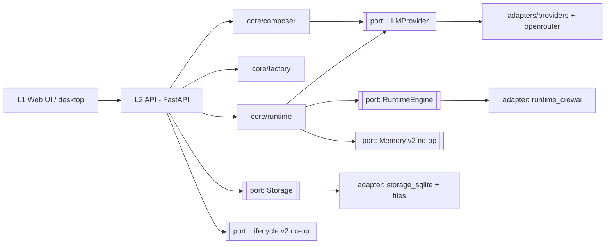

# Architecture Spine — team_maker

## Design Paradigm

**Layered + ports-and-adapters (hexagonal) around the existing pipeline core.** Everything that
varies or is replaceable sits behind a **port**; concrete implementations are **adapters**. The
v1/v2 seam *is* the adapter boundary — memory, always-on, local-model fleets, and even a runtime
swap all attach as adapters without touching the core.

Layers → namespaces (single repo, modular monolith):

```text
L1  web/            React/Next UI (+ deferred desktop wrapper)
L2  api/            FastAPI app layer (the only thing L1 talks to)
    core/
      composer/     LLM authors a Team Spec from conversation
      factory/      existing team_maker — Team Spec → Team Package (untouched)
      runtime/      executes a Team Package; agents collaborate
    ports/          interfaces: LLMProvider, RuntimeEngine, Storage, Memory*, Lifecycle*
    adapters/       providers/ (anthropic, openai, gemini, groq, ollama, openrouter),
                    runtime_crewai/, storage_sqlite/    (* Memory/Lifecycle = v1 no-op)
```

## Invariants & Rules

### AD-1 — Factory stays a pure factory [ADOPTED]
- **Binds:** `core/factory` (existing team_maker)
- **Prevents:** side-effects and provider-branching leaking into generation; loss of idempotency
- **Rule:** generators remain pure string producers; only the writer touches disk; provider
  routing stays data-driven (never branch on provider name); output is idempotent. New behavior
  goes in Composer/Runtime/adapters, never inside the factory.

### AD-2 — Ports-and-adapters boundary
- **Binds:** all
- **Prevents:** v2 features (memory, always-on, local fleets, runtime swap) forcing a core rewrite
- **Rule:** core services depend only on port interfaces; adapters implement ports; no core code
  imports an adapter concretely. Adding/replacing an implementation is an adapter change.

### AD-3 — Single-repo modular monolith
- **Binds:** repo, packaging, deployment
- **Prevents:** multi-repo/microservice sprawl users can't easily download or install
- **Rule:** one open-source repo; ports/adapters are module seams, not network services.
  Distribute via Docker, pip (Python core + CLI), a desktop bundle (deferred), and the web UI
  served by the backend. One deployable process by default.

### AD-4 — Dependency direction
- **Binds:** all
- **Prevents:** UI/adapters reaching into the core; circular coupling
- **Rule:** dependencies point inward only: `UI → API → core (ports) → adapters`. The UI reaches
  the system *only* through the API; adapters never depend on UI or on each other.



### AD-5 — Composition ownership (Composer → Factory → Runtime)
- **Binds:** `composer`, `factory`, `runtime` (FR-1, FR-20, FR-5, FR-8)
- **Prevents:** the execution engine silently owning team design and eroding the LLM-composed,
  multi-provider differentiator
- **Rule:** the Composer (LLM) authors the Team Spec; the Factory deterministically builds the
  Team Package; the Runtime **executes only**. The runtime never decides team membership/roles;
  CrewAI auto-planning / hierarchical auto-assignment is not used.

### AD-6 — Runtime engine is CrewAI, behind a port
- **Binds:** `runtime`, `ports/RuntimeEngine` (FR-8, FR-9)
- **Prevents:** hard coupling to one engine
- **Rule:** v1 executes teams via a CrewAI adapter behind `RuntimeEngine`; core/runtime depends
  only on the port. Swapping engines is an adapter change.

### AD-7 — Per-agent multi-provider routing correctness
- **Binds:** `runtime`, `adapters/providers` (FR-6, FR-10, FR-21, FR-22)
- **Prevents:** the CrewAI/litellm #5139 failure class — agents on different providers falling
  back to global env credentials
- **Rule:** each agent is executed with an explicit per-agent LLM instance carrying its full
  credentials/endpoint; routing never relies on global env vars. A **multi-provider conformance
  test** (a team spanning ≥2 providers asserts each agent hit its intended provider) is required
  and gates every CrewAI version change.

### AD-8 — Single LLM/Provider port; OpenRouter is an adapter and the default multi-provider path
- **Binds:** `composer`, `runtime`, `adapters/providers` (FR-4, FR-6, FR-22)
- **Prevents:** divergent LLM-access paths; single-provider lock-in
- **Rule:** all LLM access (Composer and agents alike) goes through one `LLMProvider` port.
  Providers (anthropic, openai, gemini, groq, ollama) and the OpenRouter gateway are adapters;
  adding a provider is an adapter/config change, never a core change. OpenRouter (one key →
  many models) is the recommended default multi-provider path.

### AD-9 — Keys live only in the Key Config file
- **Binds:** `key config`, `api`, `ui`, `runtime` (FR-10, FR-12, FR-21, FR-22)
- **Prevents:** key leakage; mid-run credential failures
- **Rule:** API keys are read from a user-managed Key Config file; never entered in the UI, never
  logged, never in run output. Key-aware resolution runs **before** any run (use available keys /
  verify a named model's key / prompt if none) and fails fast with a plain-language reason.

### AD-10 — Composer output must pass the factory schema
- **Binds:** `composer`, `factory/schema` (FR-1, FR-2, FR-20)
- **Prevents:** invalid specs reaching the Factory or the user
- **Rule:** the Composer emits the Team Spec as structured output validated against the factory's
  Pydantic schema, with a bounded validate-and-repair loop; only a passing spec is surfaced or
  built. Every conversational edit re-validates.

### AD-11 — Local, embedded state only (v1)
- **Binds:** `storage`, `adapters/storage_sqlite` (FR-24, FR-25, FR-26)
- **Prevents:** infra dependence that breaks the "download and run" promise; premature DB/cloud coupling
- **Rule:** persistence is local only — SQLite + files for the recent-teams list and saved
  results; Team Packages are self-contained on disk; attached documents are transient to a
  run/session (not persisted); no external database or services in v1.

### AD-12 — v1/v2 seam via no-op ports
- **Binds:** all (§6.2 v2 items)
- **Prevents:** v2 capabilities (memory/learning, always-on) forcing a rewrite; v1 coupling to
  their absence
- **Rule:** `Memory` and `Lifecycle` are defined ports with v1 no-op adapters. v1 runs are
  on-demand and stateless beyond saved results; nothing in the core assumes persistent team
  memory or long-running team services.

### AD-13 — Results are batch behind a streamable interface
- **Binds:** `runtime`, `api`, `ui` (FR-11)
- **Prevents:** a v2 streaming retrofit breaking the result contract
- **Rule:** v1 returns final + per-task outputs in batch through a results interface shaped to
  later stream; the UI reads run progress via that interface (v1: on-completion; v2: incremental).

## Consistency Conventions

| Concern | Convention |
| --- | --- |
| Naming | Glossary terms (PRD §3) verbatim across code/API/UI; agent role names snake_case + unique (factory rule); ports named `<Capability>` interfaces, adapters `<impl>_<capability>`. |
| Data & formats | Team Spec = YAML conforming to the factory Pydantic schema; Team Package = self-contained dir; IDs/dates ISO 8601; API error envelope structured, UI messages plain-language (EXPERIENCE.md Voice). |
| State & cross-cutting | Keys read-only from Key Config, never logged; config via files/env for non-secret settings; single LLMProvider port for all model calls; run credential resolution is pre-run fail-fast. |
| Frontend | shadcn/ui defaults inherited; only the Coinpela brand layer overrides tokens (DESIGN.md); all color is semantic tokens (theme swappable in one place); light + dark ship together. |

## Stack

| Name | Version |
| --- | --- |
| Python (core: factory, composer, runtime) | 3.12+ (min 3.10) |
| pydantic (schema/validation) | v2 |
| FastAPI (API layer) | 0.139.x |
| CrewAI (runtime adapter, behind port) | 1.14.6 (pin pending conformance test) |
| LiteLLM / native provider SDKs (via CrewAI) | per CrewAI 1.14.6 |
| Next.js / React / Tailwind | 16.2 LTS / 19 / v4 |
| shadcn/ui | current (React 19 + Tailwind v4) |
| SQLite (storage) | stdlib |
| click · pyyaml · rich (existing CLI/core) | existing pins |

## Structural Seed

```text
team_maker/                 # single open-source repo
  team_maker/               # Python core (EXISTING factory kept intact)
    schema/ domain/ templates/ generators/ pipeline/ artifacts/ validation/ utils/
    composer/               # NEW — LLM authors Team Spec (behind LLMProvider port)
    runtime/                # NEW — executes Team Package (behind RuntimeEngine port)
    ports/                  # LLMProvider, RuntimeEngine, Storage, Memory*, Lifecycle*
    adapters/
      providers/            # anthropic, openai, gemini, groq, ollama, openrouter
      runtime_crewai/       # CrewAI execution adapter
      storage_sqlite/       # recent-teams + saved results
  api/                      # FastAPI app: compose/create, run, teams, settings
  web/                      # Next.js + shadcn UI (New Team, Starter Teams, My Teams,
                            #   Team Workspace, Settings)
  desktop/                  # DEFERRED wrapper (Tauri v2 or Electron)
  tests/                    # incl. multi-provider conformance test (AD-7)
```

## Capability → Architecture Map

| Capability / Area | Lives in | Governed by |
| --- | --- | --- |
| Conversational Composer (FR-1, FR-20, FR-2, FR-4) | `core/composer` + LLMProvider adapter | AD-5, AD-8, AD-10 |
| Factory generation (FR-5, FR-6, FR-7) | `team_maker/*` (existing) | AD-1, AD-8 |
| Runtime / collaboration (FR-8, FR-9, FR-11) | `core/runtime` + runtime_crewai | AD-6, AD-7, AD-13 |
| Key & provider config (FR-10, FR-12, FR-13, FR-21, FR-22) | Key Config file + providers adapters | AD-8, AD-9 |
| Minimal UI (FR-14, FR-15) | `web/` | AD-4, frontend conventions |
| Developer API (FR-16, FR-17, FR-18) | `api/` | AD-4 |
| Starter teams (FR-19) | Team Specs shipped in repo | AD-5, AD-10 |
| Team Workspace: chat, docs, save, recent (FR-23–FR-26) | `api/` + `core/runtime` + storage_sqlite | AD-11, AD-13 |

## Deferred

- **Desktop wrapper (Tauri v2 vs Electron)** — web (+Docker) is primary; wrapper is swappable and
  must not block v1. Pick when packaging is prioritized; tradeoff (bundle size vs render
  consistency) recorded in the memlog.
- **Team memory / learning-while-working (v2)** — attaches via the `Memory` port.
- **Always-on teams (v2)** — attaches via the `Lifecycle` port.
- **Managed/large local-model fleets (v2)** — provider adapters + a management layer.
- **Streaming results (v2)** — attaches at the AD-13 results interface.
- **Team versioning (v2)** — v1 keeps a recent-teams list only.
- **Hosted / no-keys tier (v2)** — deployment + key-custody model; out of the local-only v1.
- **Composer default model** — configurable behind LLMProvider; concrete default TBD.
- **Document handling mechanism** — in-context vs retrieval, size/type limits (PRD Open Q6).
- **CrewAI version pin** — confirm per-agent multi-provider routing via the AD-7 conformance test
  before locking 1.14.6.
